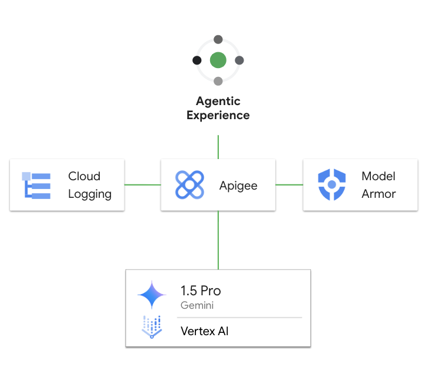

# llm-security

- This is a sample Apigee proxy to demonstrate the security capabilities of Apigee with Model Armor to secure the user prompts

## Pre-Requisites

1. [Provision Apigee X](https://cloud.google.com/apigee/docs/api-platform/get-started/provisioning-intro)
2. Configure [external access](https://cloud.google.com/apigee/docs/api-platform/get-started/configure-routing#external-access) for API traffic to your Apigee X instance
3. Enable Vertex AI in your project
4. Enable Model Armor in your project and create a template. This template ID is needed to deploy the proxy. You can use the [sample config](./config/modelarmor-template.json) to create a Model Armor template
5. Make sure the following tools are available in your terminal's $PATH (Cloud Shell has these preconfigured)
    - [gcloud SDK](https://cloud.google.com/sdk/docs/install)
    - [apigeecli](https://github.com/apigee/apigeecli)
    - unzip
    - curl
    - jq

## Get started

Proceed to this [notebook](llm_security_v1.ipynb) and follow the steps in the Setup and Testing sections.